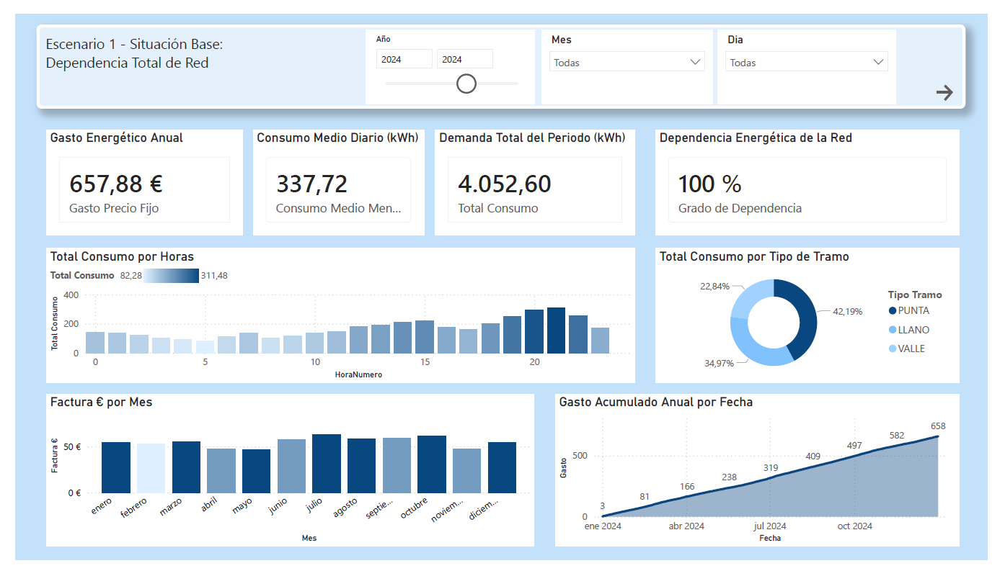
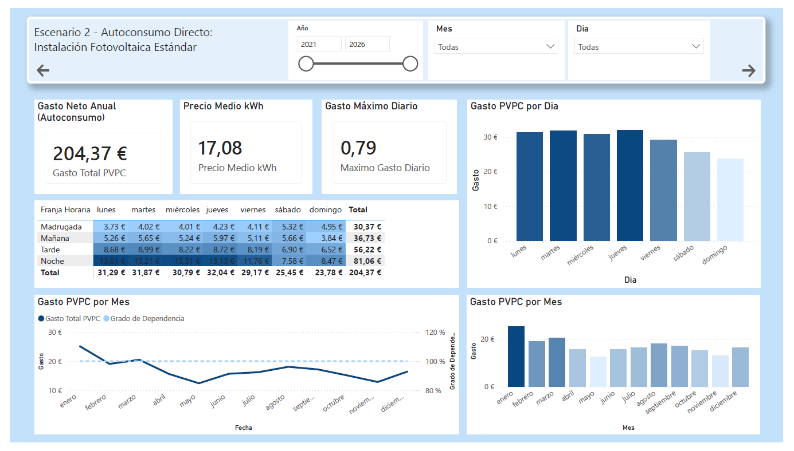
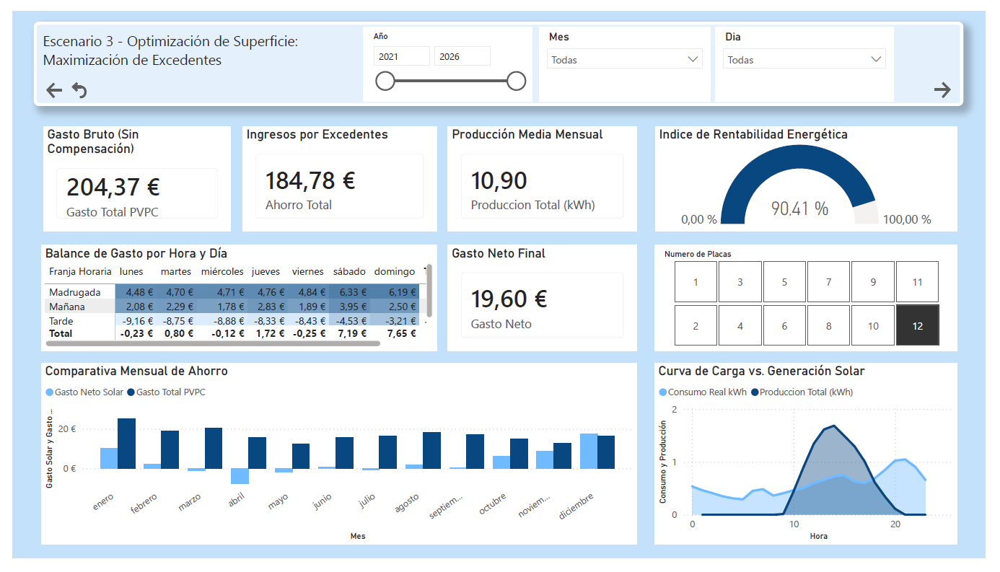
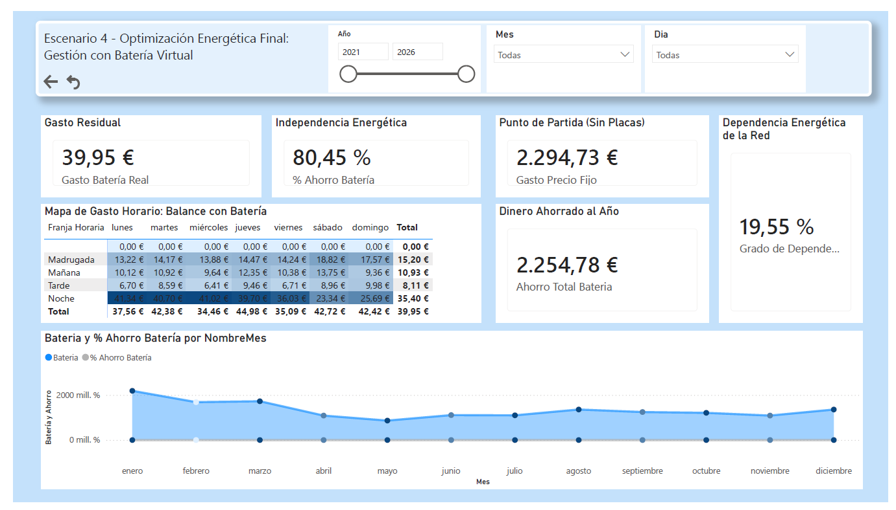

# 📊 Análisis de Eficiencia Energética y Simulación de Autoconsumo Fotovoltaico

Proyecto analítico enfocado en el sector energético, diseñado para evaluar el impacto económico y operativo de la transición hacia energías renovables. A través de **Power BI**, se procesaron curvas de carga horarias y tarifas eléctricas para simular y comparar **4 escenarios clave de consumo**, optimizando la toma de decisiones financieras y de sostenibilidad.

---

## 🚀 Estructura del Dashboard: Los 4 Escenarios Simulados

### 📍 Escenario 1 - Situación Base: Dependencia Total de Red
Análisis del punto de partida del consumidor bajo una tarifa de precio fijo. Permite identificar los picos de demanda por horas y el impacto de la distribución del consumo por tipos de tramo (*Punta, Llano, Valle*).
* **Métricas clave:** Gasto energético anual, demanda total del periodo (kWh), consumo medio diario y curva de gasto acumulado anual.

---

### ☀️ Escenario 2 - Autoconsumo Directo: Instalación Fotovoltaica Estándar
Simulación del impacto inmediato de la implantación de placas solares sin almacenamiento. Permite evaluar la reducción del gasto neto anual, el precio medio del kWh y el comportamiento del gasto PVPC distribuido por franja horaria y días de la semana.
* **Métricas clave:** Gasto neto anual, precio medio kWh bajo autoconsumo y gráfica de correlación entre el gasto total y el grado de dependencia energética.

---

### 📈 Escenario 3 - Optimización de Superficie: Maximización de Excedentes
Estudio avanzado enfocado en la escala de la instalación según el número de placas. Analiza el balance entre el gasto bruto (sin compensación) y los ingresos generados por los excedentes vertidos a la red eléctrica.
* **Métricas clave:** Índice de Rentabilidad Energética, producción media mensual, ahorro total y la comparativa visual de la curva de carga frente a la generación solar.

---

### 🔋 Escenario 4 - Optimización Energética Final: Gestión con Batería Virtual
Simulación de un ecosistema energético avanzado mediante el uso de una batería virtual. Permite acumular el valor económico de los excedentes producidos en horas de alta radiación para compensar el consumo en los meses de menor producción solar.
* **Métricas clave:** Reducción drástica del grado de dependencia energética de la red (bajada al 19,55%), porcentaje de ahorro de la batería y dinero total ahorrado al año (2.254,78 €).

---

## 🛠️ Stack Tecnológico y Habilidades Aplicadas

* **Modelado de Datos Robustos:** Integración y relación de datasets de consumo real por horas, datos de generación fotovoltaica, tramos horarios y estructuras de tarifas.
* **Lenguaje DAX Avanzado:** Implementación de medidas e indicadores calculados complejos para obtener balances netos, gastos acumulados cronológicos, tasas de ahorro y matrices de gasto horario detalladas por días.
* **Storytelling & Navegación:** Diseño de interfaz de usuario (UI) limpio y profesional, estructurado con un menú interactivo que facilita al usuario la transición entre escenarios y el descubrimiento de insights de negocio.

---

## 🎯 Conclusiones de Negocio Extraídas del Análisis
La comparativa de los datos demuestra que la evolución estratégica desde el Escenario 1 hasta el Escenario 4 permite transformar un **gasto anualizado base de 657,88 €** en un **gasto residual de apenas 39,95 €**, logrando una **independencia energética del 80,45%** y un retorno financiero óptimo para el usuario.
